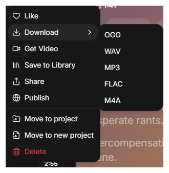

<div align="center">

# 🎵 Lyric Visualizer

**Browser-native karaoke editor — sync lyrics to music, edit word-level timings, and export for Spotify & Apple Music**

[](LICENSE)
[](https://www.typescriptlang.org/)
[](https://vitejs.dev/)
[](https://developer.mozilla.org/en-US/docs/Web/API/IndexedDB_API)

[Features](#-features) · [Quick Start](#-quick-start) · [Live TAP](#-live-tap-mode) · [Whisper](#-whisper-auto-alignment) · [Export](#-export-formats) · [Contributing](#-contributing)

</div>

---

## What is it?

Lyric Visualizer lets you take any audio file and a set of lyrics, then precisely align each word to its moment in the song. The result can be exported as **LRC** or **LRC+** — the formats used by Spotify, Apple Music, and karaoke players — or as raw JSON for custom use.

Everything runs in your browser. No accounts, no uploads, no servers required.

---

## ✨ Features

| Feature | Description |
|---|---|
| **Word-level timing** | Assign precise start/end timestamps to every word |
| **Timeline block editor** | Drag, resize, lasso-select, and pan/zoom word blocks on a canvas |
| **Three display modes** | Multiline · Rail (karaoke scroll) · Full text |
| **Live TAP** | Hit `Space` in real time while audio plays to record word onsets |
| **Whisper AI** | Optional local transcription server for automatic alignment |
| **Fuzzy alignment** | Needleman-Wunsch algorithm maps Whisper output to your exact lyrics |
| **LRC / LRC+ export** | Word-level enhanced LRC compatible with Spotify & Apple Music |
| **Local-first** | All data lives in your browser's IndexedDB — nothing leaves your machine |
| **Fixture projects** | Built-in demo projects to explore the app immediately |

---

## 🔒 Privacy

- Runs entirely in your browser — no backend, no cloud sync
- Audio files are stored as local browser Blobs
- Lyrics and timings never leave your machine by default
- Optional Whisper integration only calls **your own** local server (e.g. `http://localhost:8000`)

---

## 🚀 Quick Start

### Prerequisites

- [Node.js](https://nodejs.org/) 18+
- npm (bundled with Node.js)

### Run locally

```bash
git clone https://github.com/xcwajdax/lyric.git
cd lyric
npm install
npm run dev
```

Open [http://localhost:5173](http://localhost:5173) — the app loads instantly with built-in demo projects.

### Build for production

```bash
npm run build      # type-checks with tsc, then bundles with Vite
npm run preview    # serve the built dist/ locally
```

---

## 🌐 Deploy on GitHub Pages

The repository includes a ready-to-use workflow at `.github/workflows/deploy-pages.yml` that builds and deploys to GitHub Pages on every push to `main`.

**One-time setup:**

1. Push the repository to GitHub
2. Go to **Settings → Pages**
3. Set **Source** to **GitHub Actions**
4. Push to `main` — your app will be live at the Pages URL shown in the deployment job

---

## 🎵 Getting Audio

Lyric Visualizer works with any local audio file (MP3, OGG, WAV, FLAC, M4A).

If you use **[Sonauto](https://sonauto.ai)** or another AI music generator, download your track first:



Then drag the file into a new Lyric Visualizer project.

---

## 🎹 Live TAP Mode

The fastest way to sync lyrics from scratch:

1. Open or create a project with audio + lyrics
2. Click **LiveTap** in the bottom HUD
3. Press `Space` as each word is sung to record its onset
4. `Backspace` to undo the last tap
5. `P` / `K` to play/pause · arrow keys to seek
6. `Ctrl+S` to save — then refine in the Timeline or Timing Editor

---

## 🤖 Whisper Auto-Alignment

For hands-free alignment, run a local [Whisper](https://github.com/openai/whisper) transcription server:

```bash
pip install -r requirements-whisper.txt
python whisper_server.py   # FastAPI on http://localhost:8000
```

Then use the Whisper controls in the Timing Editor. The app:

1. Sends your audio to the local server
2. Receives word-level timestamps back
3. Runs **Needleman-Wunsch** fuzzy alignment to map Whisper words → your exact lyrics
4. Interpolates timestamps for any unmatched words

Supported models: `tiny` through `large-v3` (default `large-v3`). Works on CUDA and CPU.

---

## 📤 Export Formats

| Format | Description |
|---|---|
| **JSON** | Full `AlignedWord[]` array with start/end timestamps — useful for custom integrations |
| **LRC** | Standard line-level lyric timing — supported by most media players |
| **LRC+** | Word-level enhanced LRC — compatible with Spotify, Apple Music, and advanced karaoke players |

---

## 🏗 Architecture

The app is a single-page application with no backend dependency. All state lives in IndexedDB.

```
Audio file + Lyrics (JSON or plain text)
          ↓ (project creation)
     IndexedDB (UserProject)
          ↓ (open project)
   AlignedWord[] in memory
          ↓ (three parallel tools)
  Visualizer  ←→  Timeline Editor  ←→  LiveTap / Whisper
          ↓
  Save → IndexedDB  |  Export → JSON / LRC / LRC+
```

### Core data type

Every word is an `AlignedWord`:

```ts
{
  word: string
  start_time: number    // seconds
  end_time: number      // seconds
  kind?: "label"        // structural label (chorus, artist name…)
  line_break?: boolean  // force line break
  verse_break?: boolean // stronger visual section separator
  blank_line?: boolean  // visual spacing without section break
}
```

### Modules

| Module | Role |
|---|---|
| `main.ts` | Bootstrap, project CRUD UI, audio playback, HUD |
| `projects.ts` | IndexedDB v2 CRUD — stores metadata, audio Blob, and `AlignedWord[]` |
| `alignment.ts` | `AlignedWord` type, binary search, JSON parsing |
| `visualizer.ts` | Canvas 2D renderer — multiline / rail / full modes |
| `timeline.ts` | Interactive block editor — drag, resize, lasso, pan/zoom |
| `editor.ts` | Table-based timing editor and raw JSON view |
| `livetap.ts` | Keyboard-driven real-time tapping |
| `lrc.ts` | LRC and LRC+ export |
| `fuzzy-align.ts` | Needleman-Wunsch alignment (Polish diacritics aware) |
| `whisper-client.ts` | HTTP client for the local Whisper server |
| `lyric-groups.ts` | Groups words into lines by time gap (0.5 s) or explicit flags |

---

## 🛠 Tech Stack

- **TypeScript 5.8** — strict type checking throughout
- **Vite 6** — fast dev server and optimized production builds
- **Canvas 2D API** — custom visualizer and timeline editor (no UI framework)
- **IndexedDB** — local persistence for projects and audio
- **Whisper** (optional) — OpenAI's speech recognition, run locally via FastAPI

---

## 🤝 Contributing

Contributions are welcome! Here's how to get started:

1. Fork the repository
2. Create a feature branch: `git checkout -b feat/my-feature`
3. Make your changes — run `npm run build` to type-check before committing
4. Open a pull request with a clear description of what changed and why

There are no automated tests; `tsc --noEmit` is the correctness gate. Please ensure it passes.

For larger changes, open an issue first to discuss the approach.

---

## 📄 License

[MIT](LICENSE) © 2026 Lyric Visualizer Contributors
